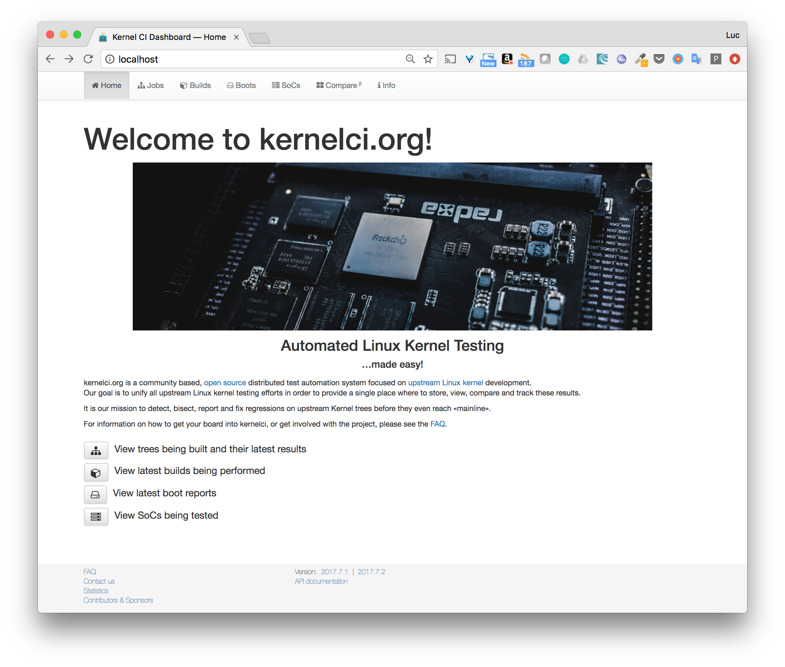
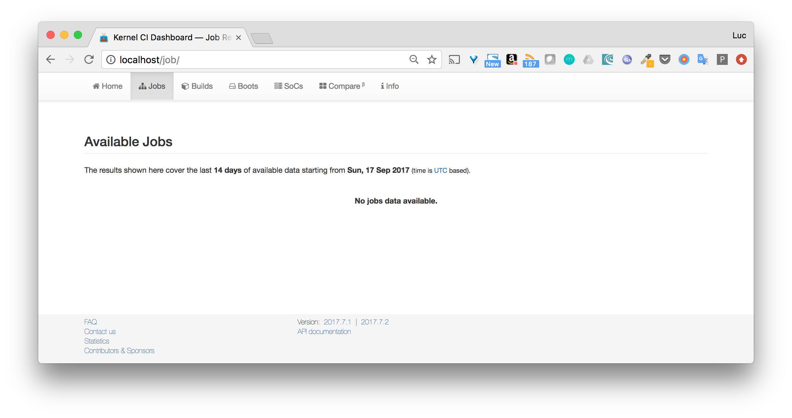

# kernelci

## Purpose

This repository eases the installation process of KernelCI (frontend + backend)

It uses docker-compose to run the services involded

- kernelci-frontend
- kernelci-backend
- proxy-backend
- redis
- mongo

Additionnal services will be added in a near future.

## Usage

The whole application can be run with the followwing command:

```
docker-compose up
```

This will create all the services and expose:
- the web frontend on localhost:80
- the api on localhost:8000 (temporary port that will be changed soon when a reserve proxy will be added)

Behind the hood, it uses the Docker images of both frontend and backend. Another image, used as proxy for the backend, is used.
All those images are stored in the temporary repositories on Docker Hub:

- [frontend image](https://hub.docker.com/r/lucj/kernelci-frontend)
- [backend image](https://hub.docker.com/r/lucj/kernelci-backend)
- [proxy for backend](https://hub.docker.com/r/lucj/kernelci-proxy-backend)

When the application is run, the MASTER_KEY of the api (set to "MASTER_KEY" string by default), is used to create an admin token

```
curl -X POST -H "Content-Type: application/json" -H "Authorization: MASTER_KEY" -d '{"email": "me@gmail.com", "admin": 1}' localhost:8090/token
{"code":201,"result":[{"token":"fd229997-944d-41f3-884f-c4c8b1cd67af"}]}
```

This admin token can then be used to perform any api calls. 

Note: one of the first action should be to create some non admin tokens in order to perform non admin actions. To keep thing simple, we'll provide the admin token to the frontend (will be changed later on).

The tokens are saved in *kernel-ci* mongo database, in the *api-token* collection. The following example shows the content of the token created above.

```
> db["api-token"].find()
{ 
    "_id" : ObjectId("59be6f32618143aa7fc170a2"),
    "username" : null,
    "expired" : false,
    "token" : "fd229997-944d-41f3-884f-c4c8b1cd67af",
    "properties" : [ 1, 1, 1, 1, 1, 0, 1, 0, 1, 0, 0, 0, 0, 0, 0, 0 ],
    "created_on" : ISODate("2017-09-17T12:48:50.604Z"),
    "version" : "1.0",
    "ip_address" : null,
    "email" : "me@gmail.com",
    "expires_on" : null
}
```

When the token is created, we need to set it in the flask_settings file of the frontend, under the BACKEND_TOKEN key. To take it into account, the frontend needs to be restarted.

```
docker-compose restart frontend
```

The interfaces is then available on localhost.



As the installation has just be done, there are no jobs available yet.



## Status

This is a work in progress [WIP], currently not fully functional.

Several features need to be added:
- to be aligned with the official KernelCI
- to improve and simplify the deployment and architecture of the whole application

Among the ongoing changes:

- [ ] Automate the setup (create token from master key, provide token to frontend)
- [ ] Add some tests
- [ ] Check storage part
- [ ] Add api documentation
- [ ] Add elasticsearch and modify backend so log files are sent to ES
- [ ] Add reverse proxy in front of the whole application (routing, TLS, ...)
